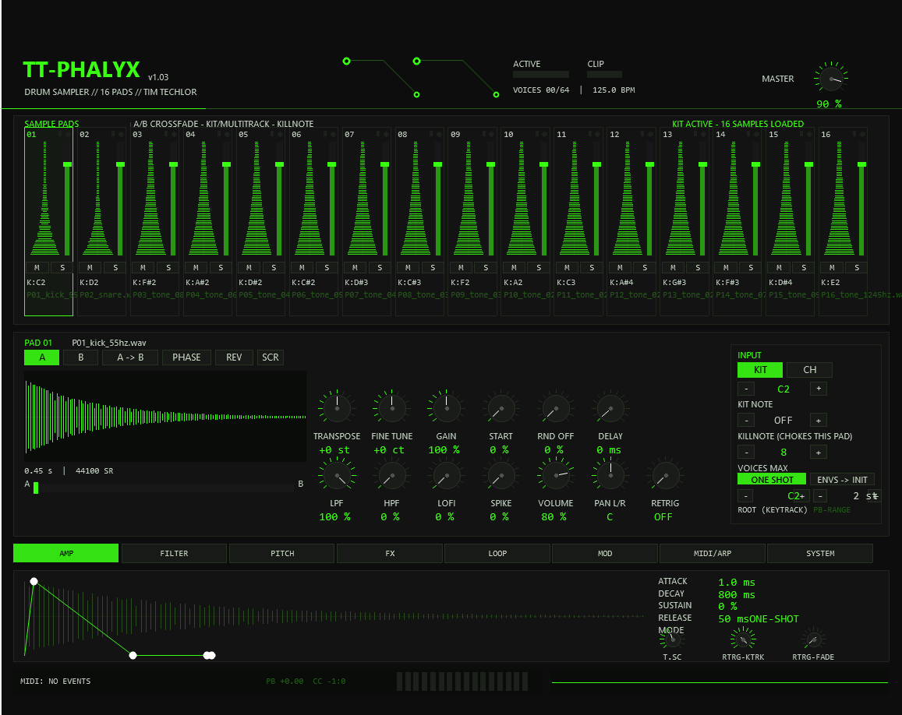

# TT-PHALYX Drum Sampler

**TT-PHALYX** is a 16-pad sample player for [REAPER](https://www.reaper.fm/), implemented as a
JSFX instrument. It packs the working depth of Vengeance *Phalanx* into the Tim Techlor design
language — core black, acid green, monospaced type (sibling of the TT-303 Acid Machine).
Pure MIDI triggering: no internal sequencer, no binaries, no dependencies — one `.jsfx` text file.

## Features

- **16 pads × 2 sample slots** (A/B) with crossfade, reverse, start/random offset, sample delay, phase invert
- **64-voice engine** (global 4–64, per pad 1–16), per-pad choke (*killnote*) and voice limit
- **Drum kit mode** (channel 1, GM note map) and **multitrack mode** (per-pad channel, tonal with keytrack) — freely mixable
- **Per pad:** amp / filter / pitch envelopes, state-variable filter (LP/HP/BP/Notch, 6/12/24 dB, clean/dirty drive), portamento (OFF/POLY/LEGATO), loop editor (normal / ping-pong / crossfade, zero-cross snap)
- **Modulation:** 8-row mod matrix, 2 LFOs, mod envelope, velocity depth + curves, GUI modifiers
- **Arpeggiator per pad** (UP/DOWN/UP-DN/RND/ROLL) with shuffle (swing), sample-accurate
- **Tempo sync** for delay time and arp rate (1/16…1/1 and 1/4…1/32, triplets included)
- **Scratcher** (drag the waveform while a note is held, or automate slider 53)
- **Master FX:** 4-band EQ + 4 insert slots — DELAY, CHORUS, FLANGER, PHASER, DISTORT, CRUSH, COMP, LIMIT, ROOM, TRASH, GATE, STEREO (room/trash/gate with predelay)
- **Pitch bend** with per-pad range (0–24 st, smoothed), incoming transpose ±24 st
- **8 parameter banks**, per-pad undo, MIDI monitor, clip LED
- **MIDI Learn** for everything via REAPER automation (63 hidden sliders)

## Requirements

- REAPER 7.x (developed and tested on 7.79), any platform that runs JSFX
- Your own WAV/AIFF samples

## Installation

1. Copy `tt-phalyx.jsfx` to `…/REAPER/Effects/TimTechlor/TT-PHALYX/tt-phalyx.jsfx`
   (create the folder; REAPER finds the FX after a browser rescan).
2. Copy the two helper scripts (`TT-PHALYX Load Kit.lua`, `TT-PHALYX Save Bank.lua`)
   to `…/REAPER/Scripts/` and register them once:
   *Actions → Show action list → New action → Load ReaScript…*
3. Insert `JS: TimTechlor/TT-PHALYX/tt-phalyx` on a track, run **Load Kit**, play —
   kit mode listens on MIDI channel 1 with the GM map (36 kick, 38 snare, 42/46 hats, …).

Full documentation: **[tt-phalyx-manual.html](tt-phalyx-manual.html)** — open it in a browser.

## Loading kits

JSFX cannot open file dialogs, so samples arrive through a kit file: the **Load Kit** action
asks for any WAV inside your kit folder, sorts the folder contents across the 16 pads
(entries 1–16 = sample A, 17–32 = sample B) and writes `tt-phalyx-kit.bin` next to the FX.
The plugin polls that file twice per second and adopts changes on the fly.
Projects store kit *paths* and all parameters — keep kit folders in a stable location.

## Banks

A bank stores the complete state of the plugin (all pads, envelopes, mod matrix, FX chain,
system settings). Save with the **Save Bank** action (slots 1–8), load with **B1–B8** in the
SYSTEM tab. Samples always come from the current kit.

## Limits vs. Phalanx

One stereo output (use multiple instances for more), 64 voices, algorithmic reverbs instead
of convolution, no plugin hosting, samples are referenced — not embedded.

## License

[MIT](LICENSE) — © TimTechlor
